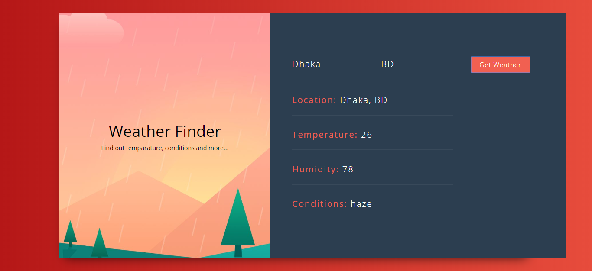

# React Weather App

![react-weather-app]


## Setup

Clone the project, install the dependencies, and run the project.

```
https://github.com/manjurulhoque/reactjs-weather-app.git
cd reactjs-weather-app
yarn # or npm install
yarn start # or npm run start
```

Then open up your browser to http://localhost:3000/, and you will be able to see the project.